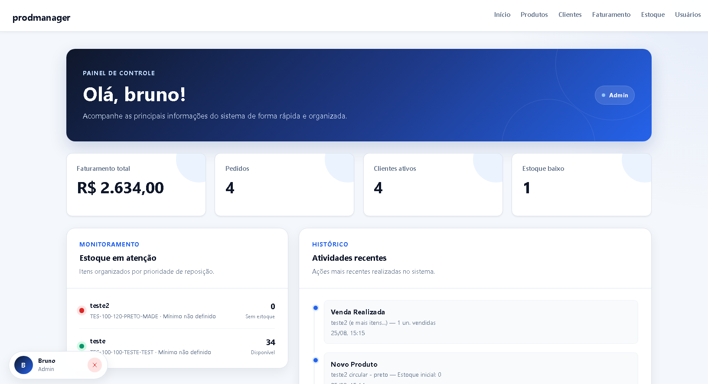
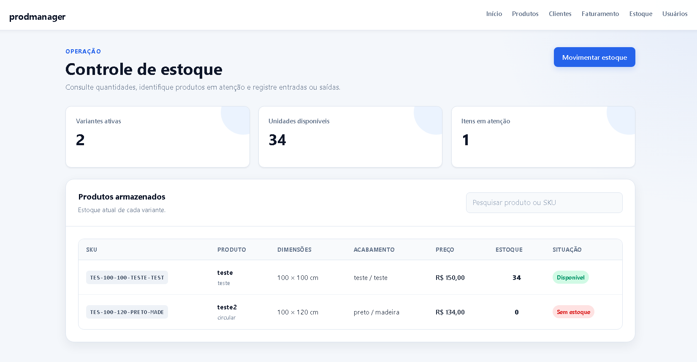
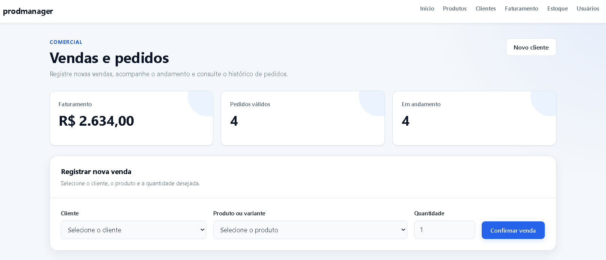
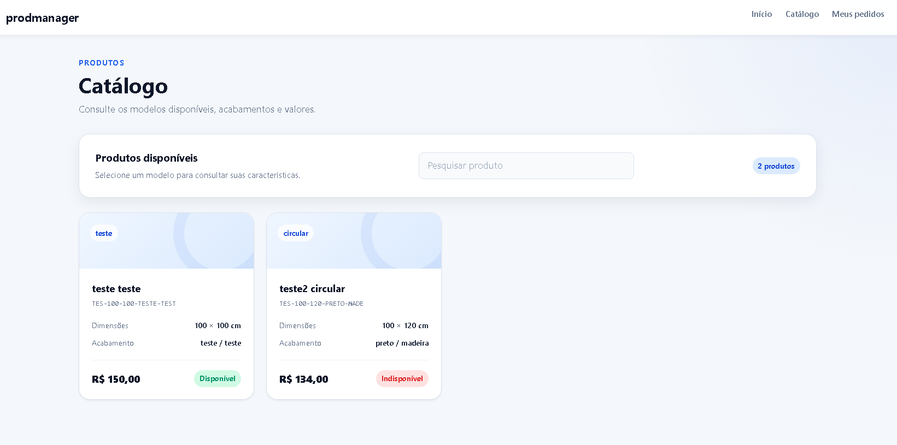
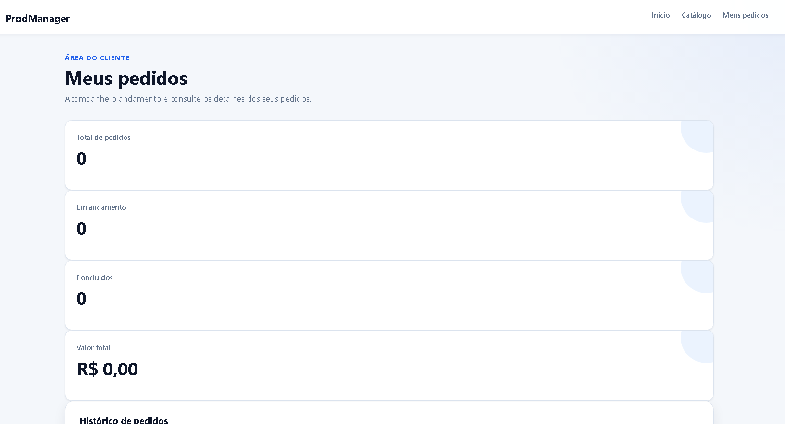

# ProdManager

Sistema web para gerenciamento de produtos, variantes, estoque, clientes e pedidos, desenvolvido com Flask, MySQL, HTML, CSS e JavaScript.



## Sobre o projeto

O ProdManager foi desenvolvido para centralizar processos importantes de uma empresa em um único sistema.

A aplicação permite controlar produtos com diferentes variantes, acompanhar movimentações de estoque, cadastrar clientes, registrar pedidos e visualizar informações operacionais em um dashboard.

O sistema também possui autenticação e controle de acesso por perfil, garantindo que cada usuário visualize apenas as funcionalidades relacionadas à sua função.

## Funcionalidades

- Autenticação com sessão do Flask.
- Controle de acesso baseado no perfil do usuário.
- Cadastro de produtos e variantes.
- Geração automática de SKU.
- Controle individual de estoque por variante.
- Registro de entradas e saídas de estoque.
- Histórico de movimentações.
- Cadastro e consulta de clientes.
- Criação de pedidos com múltiplos produtos.
- Cálculo automático do valor total.
- Validação de estoque antes da venda.
- Atualização do status dos pedidos.
- Cancelamento de pedidos com devolução automática ao estoque.
- Dashboard com indicadores operacionais.
- Catálogo de produtos para clientes.
- Área para o cliente acompanhar seus próprios pedidos.
- Interface responsiva para computadores, tablets e celulares.

## Perfis de acesso

| Perfil | Permissões principais |
|---|---|
| Administrador | Acesso completo ao sistema e gerenciamento de usuários |
| Comercial | Produtos, clientes, faturamento e pedidos |
| Estoque | Consulta e movimentação do estoque |
| Cliente | Catálogo e acompanhamento dos próprios pedidos |

As permissões são verificadas no backend. Portanto, esconder uma opção da interface não é a única proteção utilizada pelo sistema.

## Tecnologias

| Área | Tecnologias |
|---|---|
| Backend | Python, Flask, Flask-SQLAlchemy e Flask-Migrate |
| Banco de dados | MySQL e PyMySQL |
| Frontend | HTML, CSS e JavaScript |
| Autenticação | Flask Session e Werkzeug |
| Configuração | python-dotenv |
| Versionamento | Git e GitHub |

## Estrutura do projeto

```text
TCC-1/
├── backend/
│   ├── app.py
│   ├── create_admin.py
│   ├── database.py
│   └── models.py
├── frontend/
│   ├── _menu.html
│   ├── cadastro_cliente.html
│   ├── catalogo_cliente.html
│   ├── clientes.html
│   ├── criar_conta.html
│   ├── estoque.html
│   ├── faturamento.html
│   ├── inicio.html
│   ├── lista_clientes.html
│   ├── login.html
│   ├── meus_pedidos.html
│   ├── produtos.html
│   ├── auth.css
│   ├── base.css
│   ├── cliente.css
│   ├── components.css
│   ├── dashboard.css
│   ├── estoque.css
│   ├── faturamento.css
│   ├── menu.css
│   └── produtos.css
├── migrations/
│   ├── versions/
│   │   └── b1b6bcf683f3_estrutura_inicial.py
│   ├── alembic.ini
│   ├── env.py
│   └── script.py.mako
├── tests/
│   ├── conftest.py
│   ├── test_auth.py
│   ├── test_estoque_pedidos.py
│   └── test_permissions.py
├── docs/
│   └── images/
├── .env.example
├── .gitignore
├── pytest.ini
├── requirements-dev.txt
├── requirements.txt
└── README.md
```

## Regras importantes do sistema

- Cada variante possui um SKU exclusivo.
- O estoque é controlado individualmente por variante.
- Uma venda não pode ser registrada sem estoque suficiente.
- Pedidos cancelados permanecem no histórico.
- O cancelamento devolve os produtos ao estoque.
- Pedidos cancelados não entram nos indicadores de faturamento.
- Clientes visualizam apenas os pedidos vinculados à própria conta.
- Apenas usuários autorizados podem alterar estoque, pedidos e clientes.

## Como executar o projeto

### Pré-requisitos

Antes de começar, instale:

- Python 3;
- MySQL Server 8;
- Git;
- MySQL Workbench, opcionalmente;
- Visual Studio Code, opcionalmente.

### 1. Clonar o repositório

```bash
git clone https://github.com/DutraBrun0/ProdManager.git
cd TCC
```

### 2. Criar o ambiente virtual

```bash
python -m venv .venv
```

No Windows PowerShell, caso a execução de scripts esteja bloqueada:

```powershell
Set-ExecutionPolicy -Scope Process -ExecutionPolicy RemoteSigned
```

Ative o ambiente virtual:

```powershell
.\.venv\Scripts\Activate.ps1
```

### 3. Instalar as dependências

```bash
python -m pip install -r requirements.txt
```

### 4. Configurar o MySQL

Execute no MySQL Workbench:

```sql
CREATE DATABASE IF NOT EXISTS sistema_tcc
CHARACTER SET utf8mb4
COLLATE utf8mb4_unicode_ci;

CREATE USER IF NOT EXISTS
'mevglass_app'@'localhost'
IDENTIFIED BY 'SUA_SENHA';

GRANT ALL PRIVILEGES
ON sistema_tcc.*
TO 'mevglass_app'@'localhost';

FLUSH PRIVILEGES;
```

A senha informada em `SUA_SENHA` deverá ser a mesma utilizada posteriormente em `DB_PASSWORD`.

### 5. Configurar as variáveis de ambiente

Crie o arquivo `.env` a partir do exemplo:

```powershell
Copy-Item .env.example .env
```

Preencha o arquivo:

```env
DB_USER=mevglass_app
DB_PASSWORD=sua_senha_do_mysql
DB_HOST=localhost
DB_PORT=3306
DB_NAME=sistema_tcc

FLASK_SECRET_KEY=sua_chave_secreta
FLASK_DEBUG=false
```

Para gerar uma chave segura:

```bash
python -c "import secrets; print(secrets.token_hex(32))"
```

Nunca envie o arquivo `.env` para o GitHub.

### 6. Aplicar as migrações

Execute as migrações para criar ou atualizar as tabelas:

```powershell
python -m flask --app .\backend\app.py db upgrade
```

Para verificar a versão atual do banco:

```powershell
python -m flask --app .\backend\app.py db current
```

### 7. Criar o primeiro administrador

Execute o script de configuração:

```powershell
python .\backend\create_admin.py
```

O script solicitará o nome, o e-mail e a senha do primeiro administrador.

### 8. Iniciar o sistema

```powershell
python .\backend\app.py
```

Acesse no navegador:

```text
http://127.0.0.1:5000
```
## Testes automatizados

Os testes utilizam um banco SQLite temporário em memória. Portanto, os dados do MySQL configurado no projeto não são alterados.

Instale as dependências de desenvolvimento:

```bash
python -m pip install -r requirements-dev.txt
```

Execute todos os testes:

```bash
python -m pytest -v
```

A suíte verifica:

- cadastro público de clientes;
- bloqueio de e-mails duplicados;
- login e criação da sessão;
- rejeição de senha incorreta;
- redirecionamento de usuários não autenticados;
- permissões dos diferentes perfis;
- proteção das movimentações de estoque;
- entrada e saída de produtos;
- bloqueio de estoque negativo;
- criação de pedidos;
- cálculo do valor total;
- redução do estoque após uma venda;
- cancelamento com devolução ao estoque.

## Segurança

O projeto aplica algumas práticas importantes:

- senhas armazenadas como hash;
- credenciais fora do código-fonte;
- chave de sessão configurada por variável de ambiente;
- validação de autenticação no backend;
- validação de permissões por perfil;
- transações com rollback em caso de erro;
- arquivo `.env` ignorado pelo Git.
- bloqueio de autenticação para usuários inativos;
- mensagens de login que não revelam qual credencial está errada;
- cookies de sessão com `HttpOnly` e `SameSite=Lax`;
- cabeçalhos contra interpretação incorreta de conteúdo e incorporação em frames;
- suporte a cookies exclusivos para HTTPS em produção.

## Interface

| Controle de estoque | Faturamento |
|---|---|
|  |  |

| Catálogo do cliente | Meus pedidos |
|---|---|
|  |  |

## Próximas melhorias

- Ampliar a cobertura dos testes automatizados.
- Criar paginação para grandes quantidades de registros.
- Adicionar recuperação de senha.
- Publicar uma demonstração online.
- Adicionar logs e monitoramento de erros.

## Autor

Desenvolvido por **Bruno Moreira Dutra**.

- [GitHub](https://github.com/DutraBrun0)
- [LinkedIn](https://www.linkedin.com/in/brunodutraaa/)

---

Este projeto foi desenvolvido para fins acadêmicos e de portfólio.
